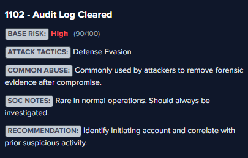

# Splunk Event Insight

**Splunk Event Insight** is a Chrome extension designed to help SOC analysts quickly understand **Windows Event IDs directly inside Splunk**.

When hovering over an **EventCode / EventID**, the extension displays a **security-focused tooltip** containing threat intelligence, attack context, and investigation guidance.

The goal is simple:

> Reduce the time analysts spend searching documentation and improve **event triage speed inside Splunk**.

---

## Features

* Hover over **EventCode / EventID** inside Splunk logs
* Instant **security context**
* **Risk classification**
* **Severity score**
* **MITRE ATT&CK tactics**
* **Common attacker abuse**
* **SOC investigation notes**
* **Response recommendations**

All information is loaded from a local **events.json knowledge base**.

---

## Example

Below is an example of the tooltip displayed when hovering over an Event ID:




---

## Tooltip Information

Each event contains the following information:

| Field          | Description                             |
| -------------- | --------------------------------------- |
| Title          | Human-readable description of the event |
| Base Risk      | Low / Medium / High classification      |
| Severity Score | SOC prioritization score (0–100)        |
| Attack Tactics | Related MITRE ATT&CK tactics            |
| Common Abuse   | How attackers typically use the event   |
| SOC Notes      | Investigation context                   |
| Recommendation | Suggested response actions              |

---

## Example Event

Example entry inside **events.json**

```json
"1102": {
  "title": "Audit Log Cleared",
  "base_risk": "High",
  "severity_score": 95,
  "common_abuse": "Attackers clear logs to remove forensic evidence after compromise.",
  "attack_tactics": ["Defense Evasion"],
  "soc_notes": "Highly suspicious in most environments.",
  "recommendation": "Investigate the user and correlate with previous suspicious actions."
}
```

---

## How It Works

1. The extension detects when the user is browsing **Splunk search results**.
2. It monitors the DOM for **EventCode / EventID fields**.
3. When the mouse hovers over an Event ID:

   * The extension extracts the event number.
   * It queries the local **events.json** database.
   * A tooltip appears with contextual SOC information.

---

## Installation

### Manual Installation (Developer Mode)

1. Open Chrome
2. Go to:

```
chrome://extensions
```

3. Enable **Developer Mode**
4. Click **Load unpacked**
5. Select the extension folder

The extension will automatically activate when visiting Splunk.

---

## Project Structure

```
splunk-event-insight/

manifest.json
content.js
tooltip.css
events.json
README.md
images/
```

| File          | Purpose                                |
| ------------- | -------------------------------------- |
| manifest.json | Chrome extension configuration         |
| content.js    | Detects Event IDs and triggers tooltip |
| tooltip.css   | Styling for the tooltip                |
| events.json   | SOC knowledge base                     |
| images        | Screenshots for README                 |

---

## Use Cases

This extension is useful for:

* SOC Analysts
* Threat Hunters
* Blue Team engineers
* Security students learning Windows logs

It allows analysts to quickly understand **security relevance of Windows Event IDs without leaving Splunk**.

---

## Future Improvements

Possible improvements include:

* API-based event intelligence
* Expanded event database
* Support for **Sysmon events**
* MITRE technique IDs
* Threat actor references
* Risk scoring based on context
* Integration with threat intelligence feeds

---

## Author

Security project focused on **SOC workflow improvement and log analysis efficiency**.

---

## Disclaimer

This tool is intended for **defensive security and SOC operations only**.
